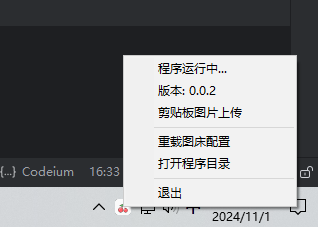
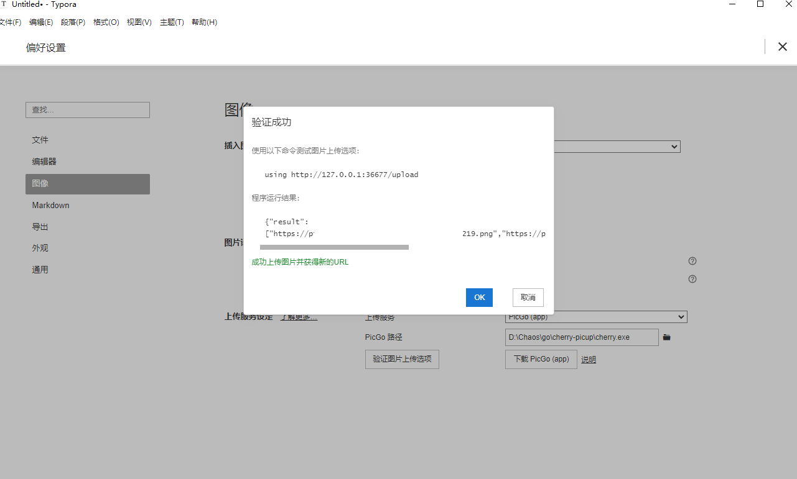
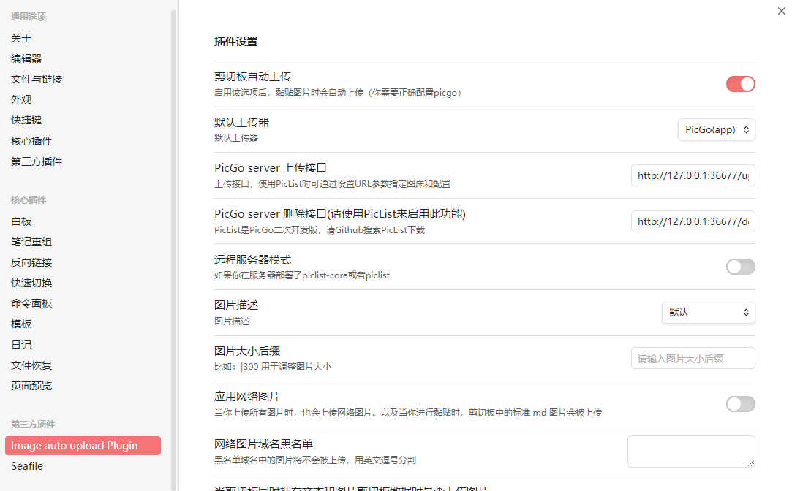

# Cherry

cherry picup

一个简易的图床工具, 类似 picgo
但是没有 electron, 也不需要 nodejs 和 npm

无 ui, 启动后暴露与 picgo 一样的本地 http 接口, 无缝衔接 obsidian / typora

目前已支持
- s3

## 使用
编译二进制文件之后直接双击启动, 带有 app tray

在根目录下按照 `cherry-setting-temple.json` 格式添加 `cherry-setting.json` 文件



### typora 配置



- 选择上传服务为 picgo
- picgo 路径选择 cherry.exe

### obsidian 配置


- 安装插件 [obsidian-image-auto-upload-plugin](obsidian://show-plugin?id=obsidian-image-auto-upload-plugin)


## 配置文件
```json
{
  "server": {
    "port": 36677,
    "host": "127.0.0.1",
    "enable": true
  },
  "s3": {
    "accessKeyID": "s3-accessKeyID",
    "secretAccessKey": "s3-secretAccessKey",
    "bucketName": "s3-bucketName",
    "uploadPath": "test-path/{timestampMS}.{extName}",
    "region": null,
    "endpoint": "endpoint",
    "urlPrefix": "https://cherry.custom-domain.com",
    "rejectUnauthorized": true,
    "disableBucketPrefixToURL": true
  }
}
```
- server 本地服务器设置
- s3: s3 接口配置